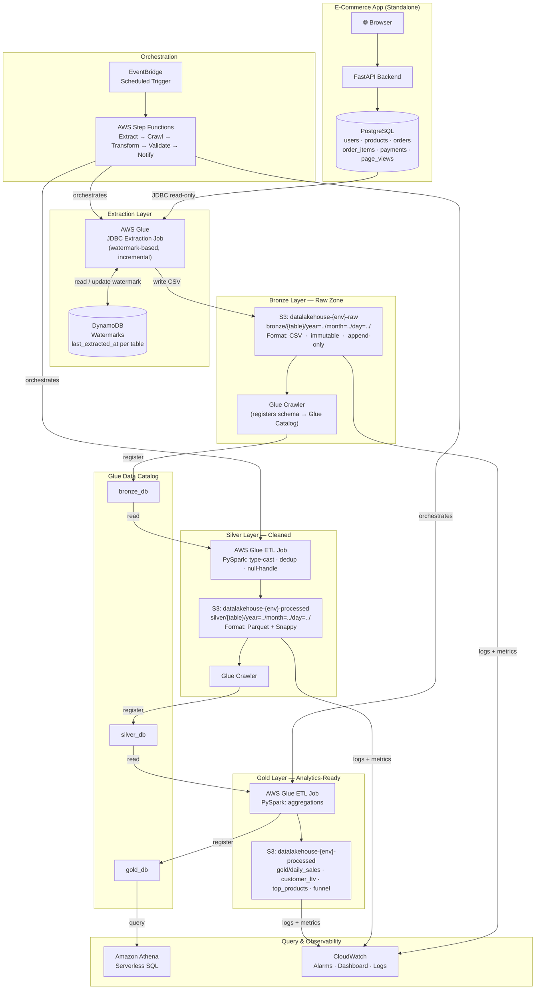

# Enterprise Data Lakehouse Pipeline on AWS

A production-grade, medallion-architecture data lakehouse on AWS. A real standalone e-commerce app generates live transactional data — the pipeline extracts, transforms, and serves it as analytics-ready tables.

> **Status:** Phase 1 — Foundation (In Progress)

---

## The Core Idea

```
Real App (runs standalone)  →  Pipeline extracts from it  →  Analytics layer
```

Two completely decoupled systems:

1. **E-commerce App** — a real web app with users, products, orders, payments. Runs independently. Has no knowledge of the data pipeline. Writes only to its own PostgreSQL database.

2. **Data Pipeline** — an AWS-native batch pipeline that periodically reaches into the app's database, extracts what's new, transforms it through three layers (Bronze → Silver → Gold), and makes it queryable via Athena.

This mirrors exactly how real companies operate: the source system team and the data engineering team are separate. The pipeline is non-invasive.

---

## Architecture



---

## Tech Stack

### E-Commerce App

| Layer | Technology |
|---|---|
| Backend | Python + FastAPI |
| Database | PostgreSQL 15 (Docker locally, RDS in cloud) |
| Frontend | HTML + Vanilla JS (Jinja2 templates) |
| Container | Docker + Docker Compose |

### Data Pipeline (AWS)

| Layer | Technology |
|---|---|
| Cloud | AWS |
| Infrastructure as Code | Terraform >= 1.6 |
| Extraction | AWS Glue (JDBC → S3) |
| ETL / Processing | AWS Glue + PySpark |
| Orchestration | AWS Step Functions |
| Storage | Amazon S3 |
| Metadata Catalog | AWS Glue Data Catalog |
| Querying | Amazon Athena v3 |
| App Database | Amazon RDS PostgreSQL |
| Monitoring | CloudWatch |
| Secrets | AWS Secrets Manager |
| Data Quality | Great Expectations |
| Data Format | CSV (Bronze), Parquet/Snappy (Silver + Gold) |
| CI/CD | GitHub Actions |

---

## Project Structure

```
datalakehouse-pipeline-aws/
│
├── app/                                # Standalone e-commerce application
│   ├── backend/
│   │   ├── main.py                     # FastAPI entrypoint
│   │   ├── database.py                 # SQLAlchemy engine + session
│   │   ├── models/                     # ORM models (User, Product, Order, etc.)
│   │   ├── routes/                     # API route handlers
│   │   ├── schemas/                    # Pydantic request/response schemas
│   │   └── requirements.txt
│   ├── frontend/
│   │   ├── templates/                  # Jinja2 HTML templates
│   │   └── static/                     # CSS + JS
│   ├── docker-compose.yml              # App + Postgres (local dev)
│   └── Dockerfile
│
├── terraform/                          # All AWS infrastructure
│   ├── modules/
│   │   ├── s3/                         # S3 buckets + lifecycle policies
│   │   ├── glue/                       # Glue catalog, crawlers, jobs
│   │   ├── rds/                        # RDS PostgreSQL (app database in cloud)
│   │   ├── athena/                     # Athena workgroups
│   │   ├── iam/                        # IAM roles and policies
│   │   ├── step_functions/             # Orchestration state machines
│   │   └── monitoring/                 # CloudWatch alarms + dashboards
│   ├── environments/
│   │   ├── dev/                        # Dev environment (wires modules)
│   │   └── prod/                       # Prod environment
│   └── global/                         # Shared provider config
│
├── pipeline/                           # Data pipeline source code
│   ├── extraction/
│   │   └── glue_jobs/
│   │       ├── extract_orders.py       # Glue job: RDS orders → Bronze S3
│   │       ├── extract_customers.py
│   │       ├── extract_products.py
│   │       ├── extract_payments.py
│   │       └── extract_page_views.py
│   ├── transformation/
│   │   └── glue_jobs/
│   │       ├── bronze_to_silver/
│   │       │   ├── orders_silver.py
│   │       │   ├── customers_silver.py
│   │       │   ├── products_silver.py
│   │       │   └── payments_silver.py
│   │       └── silver_to_gold/
│   │           ├── daily_sales.py
│   │           ├── customer_ltv.py
│   │           └── top_products.py
│   ├── quality/                        # Great Expectations suites
│   └── utils/                          # Shared helpers (watermark, S3, secrets)
│
├── athena/
│   ├── queries/
│   │   ├── analytics/                  # Business metric SQL
│   │   └── validation/                 # Data quality SQL checks
│   └── views/                          # Gold layer Athena views
│
├── orchestration/
│   └── step_functions/
│       ├── pipeline_definition.json    # Full pipeline state machine (ASL)
│       └── README.md
│
├── monitoring/
│   ├── dashboards/
│   └── alarms/
│
├── tests/
│   ├── unit/                           # Test transforms (no AWS needed)
│   ├── integration/                    # Test against real dev AWS
│   └── app/                            # App unit + API tests
│
├── docs/
│   ├── architecture/
│   │   ├── decisions/                  # Architecture Decision Records (ADRs)
│   │   └── data-flow.md
│   └── phases/
│
├── scripts/
│   ├── setup.sh
│   ├── deploy-pipeline.sh
│   └── teardown.sh
│
├── .github/workflows/
├── Makefile
├── pyproject.toml
├── .pre-commit-config.yaml
├── CLAUDE.md
└── README.md
```

---

## Build Phases

| Phase | Name | What Gets Built | Status |
|---|---|---|---|
| 1 | Foundation | S3 buckets, IAM roles, Glue Catalog, Athena workgroup — all via Terraform (local state) | In Progress |
| 2 | E-Commerce App | FastAPI app + PostgreSQL + Docker Compose. Users, products, orders, payments, page views. | Not Started |
| 3 | Extraction Layer | Glue JDBC jobs: extract from RDS → write CSV to Bronze S3 with watermarking | Not Started |
| 4 | ETL Layer | Glue PySpark jobs: Bronze CSV → Silver Parquet (typed, deduplicated, partitioned) | Not Started |
| 5 | Gold + Query Layer | Silver aggregations → Gold tables. Athena SQL analytics queries. | Not Started |
| 6 | Orchestration | Step Functions: schedule and chain Extract → Crawl → Transform → Validate | Not Started |
| 7 | Monitoring | CloudWatch alarms for Glue failures, Athena costs, pipeline SLA | Not Started |
| 8 | Data Quality | Great Expectations checks as pipeline gate — fail pipeline if data quality drops | Not Started |
| 9 | Advanced | Apache Iceberg table format, CDC via AWS DMS, EMR for scale | Not Started |

---

## Data Model

### App Database (PostgreSQL)

| Table | Key Columns | Extracted How |
|---|---|---|
| `users` | id, email, name, created_at | Full + incremental on `created_at` |
| `products` | id, name, category, price, stock | Full (small, slowly changing) |
| `orders` | id, user_id, status, total, created_at | Incremental on `created_at` |
| `order_items` | id, order_id, product_id, qty, price | Incremental on `order_id` |
| `payments` | id, order_id, amount, method, status, created_at | Incremental on `created_at` |
| `page_views` | id, user_id, path, referrer, created_at | Incremental on `created_at` |

### Extraction Pattern: Watermarking

Each Glue extraction job tracks a **watermark** — the last extracted `created_at` timestamp, stored in DynamoDB or S3. On each run:

```
SELECT * FROM orders WHERE created_at > {last_watermark} ORDER BY created_at
```

This ensures: no full table scans, no duplicates, idempotent re-runs.

### Gold Layer Aggregations

| Table | Description | Source |
|---|---|---|
| `daily_sales` | Revenue, order count, AOV per day | orders + payments |
| `customer_ltv` | Lifetime value and order frequency per user | users + orders + payments |
| `top_products` | Revenue + units sold per product | order_items + products |
| `funnel_analysis` | Browse → add-to-cart → purchase conversion | page_views + orders |

---

## S3 Layout

```
s3://datalakehouse-{env}-raw/
  bronze/
    orders/year=2026/month=06/day=08/batch_id=abc123.csv
    customers/year=2026/month=06/day=08/batch_id=abc123.csv
    payments/year=2026/month=06/day=08/batch_id=abc123.csv
    order_items/year=2026/month=06/day=08/
    page_views/year=2026/month=06/day=08/hour=14/

s3://datalakehouse-{env}-processed/
  silver/
    orders/year=2026/month=06/day=08/       ← Parquet
    customers/year=2026/month=06/
    payments/year=2026/month=06/day=08/
    order_items/year=2026/month=06/day=08/
    page_views/year=2026/month=06/day=08/hour=14/
  gold/
    daily_sales/
    customer_ltv/
    top_products/
    funnel_analysis/

s3://datalakehouse-{env}-athena-results/
s3://datalakehouse-{env}-glue-scripts/
```

---

## How the Two Systems Connect

The app and pipeline are **fully decoupled**. The connection point is the RDS database:

```
App writes → PostgreSQL (RDS)
                   ↑
Pipeline reads from here (read-only connection, separate IAM role, read replica in prod)
```

The app never knows the pipeline exists. The pipeline never modifies app data. This separation is the real-world pattern.

---

## Getting Started

### Prerequisites

- AWS CLI configured (`aws configure`)
- Terraform >= 1.6
- Python >= 3.11
- Docker + Docker Compose
- `make` installed

### Run the App Locally

```bash
cd app
docker-compose up
# App: http://localhost:8000
# Postgres: localhost:5432
```

### Deploy Pipeline Infrastructure

```bash
cd terraform/environments/dev
terraform init
terraform plan
terraform apply
```

---

## Key Concepts

### Why Watermarking Over Full Extract?
Full table extract is simple but doesn't scale. 1M orders today = full re-scan every pipeline run. Watermarking extracts only new rows — cost and time grow with daily volume, not total history.

### Why JDBC Extraction Over DMS?
AWS DMS (Change Data Capture) is more real-time but adds operational complexity. JDBC batch extraction via Glue is simpler, cheaper, and perfectly adequate for batch analytics use cases. DMS is Phase 9.

### Why Separate Bronze From Silver?
Bronze preserves the source record exactly as it arrived. If a transform has a bug, you fix the job and re-process Bronze — you never need to re-extract from the source. Bronze = replayability.

### Why Parquet in Silver?
Parquet is columnar. A query selecting 3 columns from a 50-column table scans only those 3 columns. Combined with Snappy compression, Athena query costs drop 5–10x compared to CSV.

---

## Cost Targets (Dev)

| Resource | Expected Monthly Cost |
|---|---|
| RDS db.t3.micro (app DB) | ~$15 |
| S3 storage (dev volume) | < $1 |
| Glue jobs (per run) | ~$0.10 per run |
| Athena (per query) | < $0.01 per query |
| Step Functions | Free tier |
| **Total (light usage)** | **~$20/month** |
